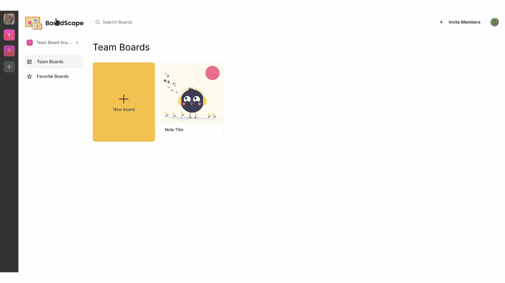

# Mind-BoardScape - Real-time Collaborative Whiteboard

A modern, real-time collaborative whiteboard application built with Next.js 14, enabling teams to visualize ideas and work together seamlessly.



## 🚀 Features

- **Infinite Canvas**: Create and explore without boundaries
- **Real-time Collaboration**: See changes instantly as team members contribute
- **Shape Tools**: Create perfect rectangles, ellipses, and more
- **Freehand Drawing**: Natural sketching and annotation tools
- **Text & Notes**: Add context with text elements and sticky notes
- **Layer Management**: Organize your work with powerful layer controls
- **Team Management**: Create organizations and manage team permissions
- **Authentication**: Secure user management with Clerk
- **Real-time Database**: Built on Convex for seamless data synchronization

## 🛠️ Tech Stack

- **Frontend**
  - Next.js 14 (App Router)
  - TypeScript
  - Tailwind CSS
  - shadcn/ui
  - Lucide Icons

- **Backend & Real-time**
  - Convex (Database & Real-time Sync)
  - Liveblocks (Collaboration Infrastructure)
  - Clerk (Authentication)

## 📋 Prerequisites

Before you begin, ensure you have the following installed:
- Node.js 18.17 or later
- npm or pnpm
- Git

## 🚀 Getting Started

1. **Clone the repository*
   ```bash
   git clone https://github.com/Surbhijain00/Mind-BoardScape.git
   cd Mind-BoardScape
   ```

2. **Install dependencies**
   ```bash
   npm install
   ```

3. **Set up environment variables**
   ```bash
   cp .env.example .env.local
   ```
   Fill in your environment variables:
   ```env
   CONVEX_DEPLOYMENT=
   NEXT_PUBLIC_CONVEX_URL=
   NEXT_PUBLIC_CLERK_PUBLISHABLE_KEY=
   CLERK_SECRET_KEY=
   LIVEBLOCKS_SECRET_KEY=
   ```

4. **Run development server**
   ```bash
   npm run dev
   ```

5. **Open your browser**
   Navigate to [http://localhost:3000](http://localhost:3000)

## 🏗️ Project Structure

```
boardscape/
├── app/
│   ├── (auth)/
│   ├── board/[boardId]/
│   └── layout.tsx
├── components/
│   ├── auth/
│   ├── board/
│   └── ui/
├── convex/
│   └── schema.ts
├── hooks/
├── lib/
└── public/
```

## 📝 Environment Variables

| Variable | Description |
|----------|-------------|
| `NEXT_PUBLIC_CLERK_PUBLISHABLE_KEY` | Clerk public key |
| `CLERK_SECRET_KEY` | Clerk secret key |
| `NEXT_PUBLIC_CONVEX_URL` | Convex deployment URL |
| `LIVEBLOCKS_SECRET_KEY` | Liveblocks secret key |


<br>
<br>

# Screenshots

<br>
<br>


## 1.🚀 Login Page


   <br>

   
## 2.🚀 Home Page

  
   <br>
   

  
   <br>
   


  
   <br>
   

  
   <br>


  
   <br>
   

  
   <br>
   <br>
   

## 3.🚀 Features Page

  
   <br>
   
   


  
   <br>
   

  
   <br>


  
   <br>
   


  <br>
  

  
   <br>
   <br>

## 4. 🚀 About Page

  
   <br>
   

  
   <br>
   


  
   <br>
   

  
   <br>


  
   <br>
   <br>
   
## 5.🚀 Dashboard Page

  
   <br>
   

  
   <br>
   


  
   <br>
   

  
   <br>
  <br>


## 🤝 Contributing

1. Fork the repository
2. Create your feature branch (`git checkout -b feature/amazing-feature`)
3. Commit your changes (`git commit -m 'Add some amazing feature'`)
4. Push to the branch (`git push origin feature/amazing-feature`)
5. Open a Pull Request


## 👏 Acknowledgments

- [Clerk](https://clerk.dev/) for authentication
- [Convex](https://www.convex.dev/) for the backend
- [Liveblocks](https://liveblocks.io/) for real-time collaboration
- [shadcn/ui](https://ui.shadcn.com/) for UI components
  
